# Use Case Diagram - Hệ thống Quản lý Đồ án Tốt nghiệp (ThesisHub)

## 1. Tổng quan

Use Case Diagram mô tả các actor và use case dựa trên [tonghop.md](./progcess/tonghop.md), theo chuẩn phân tích thiết kế phần mềm (UML 2.x).

---

## 2. PlantUML (có thể render tại plantuml.com hoặc VS Code với extension PlantUML)

```plantuml
@startuml ThesisHub - Use Case Diagram

!theme plain
skinparam actorStyle awesome
skinparam useCase {
  BackgroundColor<<include>> LightBlue
  BackgroundColor<<extend>> LightYellow
}

left to right direction

rectangle "Hệ thống Quản lý Đồ án Tốt nghiệp (ThesisHub)" {

  package "1. Xác thực" {
    usecase (UC-1.1\nĐăng nhập) as UC11
    usecase (UC-1.2\nĐăng xuất) as UC12
  }
  package "2. Thiết lập đợt & danh sách" {
    usecase (UC-2.1\nKhởi tạo đợt đồ án) as UC21
    usecase (UC-2.2\nLập danh sách SV) as UC22
  }
  package "3. Quản lý đề tài" {
    usecase (UC-3.1\nGV đăng ký đề tài) as UC31
    usecase (UC-3.2\nSV chọn/đề xuất đề tài) as UC32
  }
  package "4. Đề cương & Tiến độ" {
    usecase (UC-4.1\nSV nộp đề cương) as UC41
    usecase (UC-4.2\nGV duyệt đề cương) as UC42
    usecase (UC-4.3\nSV cập nhật tiến độ) as UC43
    usecase (UC-4.4\nGV theo dõi tiến độ) as UC44
  }
  package "5. Đăng ký bảo vệ" {
    usecase (UC-5.1\nSV đăng ký bảo vệ) as UC51
    usecase (UC-5.2\nGV duyệt đăng ký bảo vệ) as UC52
  }
  package "6. Bảo vệ đồ án" {
    usecase (UC-6.1\nLập hội đồng & phân công GV) as UC61
    usecase (UC-6.2\nXếp lịch bảo vệ) as UC62
    usecase (UC-6.3\nChuẩn bị hồ sơ cho HĐ) as UC63
    usecase (UC-6.4\nTiến hành buổi bảo vệ) as UC64
    usecase (UC-6.5\nChấm điểm & chốt kết quả) as UC65
  }
  package "7. Hoàn thiện & lưu trữ" {
    usecase (UC-7.1\nNộp bản cuối sau BV) as UC71
    usecase (UC-7.2\nGV/Chủ tịch HĐ duyệt bản cuối) as UC72
    usecase (UC-7.3\nChốt kết quả thesis) as UC73
    usecase (UC-7.4\nTra cứu & lưu trữ hồ sơ) as UC74
  }
}

actor "Hệ thống SSO\n(Zitadel)" as SSO <<External System>>

' Actors
actor "Phòng Đào tạo\n(PĐT)" as PDT
actor "Trưởng ngành" as HEAD
actor "Giảng viên" as GV
actor "Sinh viên" as SV
actor "Thư ký Hội đồng" as SEC
actor "Chủ tịch Hội đồng" as CHAIR

' Actor inheritance
GV <|-- SEC
GV <|-- CHAIR

' Xác thực
PDT --> UC11 & UC12
HEAD --> UC11 & UC12
GV --> UC11 & UC12
SV --> UC11 & UC12
SSO --> UC11 : <<supports>>
SSO --> UC12 : <<supports>>

' Thiết lập
PDT --> UC21 & UC22
HEAD --> UC22

' Quản lý đề tài
GV --> UC31 & UC32
HEAD --> UC32
SV --> UC32

' Đề cương & Tiến độ
SV --> UC41 & UC43
GV --> UC42 & UC44

' Đăng ký bảo vệ
SV --> UC51
GV --> UC52

' Bảo vệ đồ án
PDT --> UC61 & UC62 & UC63
HEAD --> UC61
SEC --> UC62 & UC63
GV --> UC64 & UC65
SV --> UC64
CHAIR --> UC65

' Hoàn thiện & lưu trữ
SV --> UC71 & UC74
GV --> UC72 & UC74
CHAIR --> UC72
PDT --> UC73 & UC74

' Include / Extend
UC32 ..> UC31 : <<include>>\n(chọn đề tài có sẵn)
UC62 ..> UC61 : <<include>>\n(cần HĐ đã lập)
UC64 ..> UC62 : <<include>>\n(cần đã xếp lịch)
UC71 ..> UC65 : <<include>>\n(sau khi chấm)
UC43 ..> UC42 : <<include>>\n(sau khi đề cương OK)

@enduml
```

---

## 3. Nhóm Use-case

| Nhóm | Use Case | Mô tả ngắn |
|------|----------|------------|
| 1. Xác thực | UC-1.1, UC-1.2 | Đăng nhập, đăng xuất qua SSO |
| 2. Thiết lập đợt & danh sách | UC-2.1, UC-2.2 | Khởi tạo đợt đồ án, lập danh sách SV |
| 3. Quản lý đề tài | UC-3.1, UC-3.2 | GV đăng ký đề tài mở, SV chọn/đề xuất |
| 4. Đề cương & Tiến độ | UC-4.1, UC-4.2, UC-4.3, UC-4.4 | Nộp/duyệt đề cương, cập nhật/theo dõi tiến độ |
| 5. Đăng ký bảo vệ | UC-5.1, UC-5.2 | SV nộp hồ sơ, GVHD duyệt |
| 6. Bảo vệ đồ án | UC-6.1, UC-6.2, UC-6.3, UC-6.4, UC-6.5 | Lập HĐ, xếp lịch, chuẩn bị, tiến hành, chấm điểm |
| 7. Hoàn thiện & lưu trữ | UC-7.1, UC-7.2, UC-7.3, UC-7.4 | Nộp/duyệt bản cuối, chốt kết quả, tra cứu |

---

## 4. Bảng Actor – Use Case

| Actor | Use Cases |
|-------|-----------|
| **Phòng Đào tạo (PĐT)** | UC-1.1, UC-1.2, UC-2.1, UC-2.2, UC-6.1, UC-6.2, UC-6.3, UC-7.3, UC-7.4 |
| **Trưởng ngành** | UC-1.1, UC-1.2, UC-2.2, UC-3.2, UC-6.1 |
| **Giảng viên** | UC-1.1, UC-1.2, UC-3.1, UC-3.2, UC-4.2, UC-4.4, UC-5.2, UC-6.4, UC-6.5, UC-7.2, UC-7.4 |
| **Sinh viên** | UC-1.1, UC-1.2, UC-3.2, UC-4.1, UC-4.3, UC-5.1, UC-6.4, UC-7.1, UC-7.4 |
| **Thư ký Hội đồng** | UC-6.2, UC-6.3 |
| **Chủ tịch Hội đồng** | UC-6.5, UC-7.2 |
| **Hệ thống SSO (Zitadel)** | UC-1.1, UC-1.2 *(External System – hỗ trợ)* |

---

## 5. Sơ đồ Mermaid (tham khảo)

```mermaid
flowchart TB
    subgraph Actors
        PDT[Phòng Đào tạo]
        HEAD[Trưởng ngành]
        GV[Giảng viên]
        SV[Sinh viên]
        SEC[Thư ký HĐ]
        SSO[SSO - External]
    end

    subgraph Auth["1. Xác thực"]
        UC11[UC-1.1 Đăng nhập]
        UC12[UC-1.2 Đăng xuất]
    end

    subgraph G1["2–5. Đăng ký & Thực hiện"]
        UC21[UC-2.1 Khởi tạo đợt]
        UC22[UC-2.2 Lập DS SV]
        UC31[UC-3.1 GV đăng ký đề tài]
        UC32[UC-3.2 SV chọn/đề xuất]
        UC41[UC-4.1 SV nộp đề cương]
        UC42[UC-4.2 GV duyệt đề cương]
        UC43[UC-4.3 SV cập nhật tiến độ]
        UC44[UC-4.4 GV theo dõi]
        UC51[UC-5.1 SV đăng ký BV]
        UC52[UC-5.2 GV duyệt ĐKBV]
    end

    subgraph G2["6. Bảo vệ đồ án"]
        UC61[UC-6.1 Lập hội đồng]
        UC62[UC-6.2 Xếp lịch BV]
        UC63[UC-6.3 Chuẩn bị hồ sơ]
        UC64[UC-6.4 Tiến hành BV]
        UC65[UC-6.5 Chấm điểm]
    end

    subgraph G3["7. Hoàn thiện & lưu trữ"]
        UC71[UC-7.1 Nộp bản cuối]
        UC72[UC-7.2 Duyệt bản cuối]
        UC73[UC-7.3 Chốt kết quả]
        UC74[UC-7.4 Tra cứu]
    end

    PDT & HEAD & GV & SV --> UC11 & UC12
    SSO --> UC11 & UC12
    PDT --> UC21 & UC22 & UC61 & UC62 & UC63 & UC73 & UC74
    HEAD --> UC22 & UC32 & UC61
    GV --> UC31 & UC32 & UC42 & UC44 & UC52 & UC64 & UC65 & UC72 & UC74
    SV --> UC32 & UC41 & UC43 & UC51 & UC64 & UC71 & UC74
    SEC --> UC62 & UC63
```



---

## 6. Luồng chính (Main Flow) – Tóm tắt

| STT | ID | Use Case | Actor chính | Điều kiện tiên quyết |
|-----|-----|----------|-------------|----------------------|
| 1 | UC-1.1 | Đăng nhập | Tất cả người dùng | - |
| 2 | UC-1.2 | Đăng xuất | Tất cả người dùng | Đã đăng nhập |
| 3 | UC-2.1 | Khởi tạo đợt đồ án | PĐT | UC-1.1 |
| 4 | UC-2.2 | Lập danh sách SV làm đồ án | PĐT, Trưởng ngành | UC-2.1 |
| 5 | UC-3.1 | GV đăng ký đề tài | Giảng viên | UC-2.1 |
| 6 | UC-3.2 | SV chọn/đề xuất đề tài | SV, GV, Trưởng ngành | UC-2.2, UC-3.1 |
| 7 | UC-4.1 | SV nộp đề cương | Sinh viên | Đề tài TOPIC_APPROVED |
| 8 | UC-4.2 | GV duyệt đề cương | GVHD | UC-4.1 |
| 9 | UC-4.3 | SV cập nhật tiến độ | Sinh viên | UC-4.2 |
| 10 | UC-4.4 | GV theo dõi tiến độ | GVHD | UC-4.2 |
| 11 | UC-5.1 | SV đăng ký bảo vệ | Sinh viên | Hoàn thành đồ án |
| 12 | UC-5.2 | GV duyệt đăng ký bảo vệ | GVHD | UC-5.1 |
| 13 | UC-6.1 | Lập hội đồng & phân công GV | PĐT, Trưởng ngành | READY_FOR_DEFENSE |
| 14 | UC-6.2 | Xếp lịch bảo vệ | PĐT, Thư ký HĐ | UC-6.1 |
| 15 | UC-6.3 | Chuẩn bị hồ sơ cho HĐ | Thư ký HĐ, PĐT | UC-6.2 |
| 16 | UC-6.4 | Tiến hành buổi bảo vệ | Hội đồng, SV | UC-6.2, UC-6.3 |
| 17 | UC-6.5 | Chấm điểm & chốt kết quả | Chủ tịch HĐ, GVHD | UC-6.4 |
| 18 | UC-7.1 | Nộp bản cuối sau BV | Sinh viên | UC-6.5 (GRADED) |
| 19 | UC-7.2 | GV/Chủ tịch HĐ duyệt bản cuối | GVHD, Chủ tịch | UC-7.1 |
| 20 | UC-7.3 | Chốt kết quả thesis | PĐT, Hệ thống | UC-6.5, UC-7.2 |
| 21 | UC-7.4 | Tra cứu & lưu trữ hồ sơ | PĐT, GV, SV | UC-1.1 (đăng nhập) |
