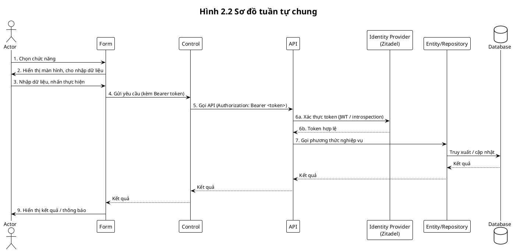
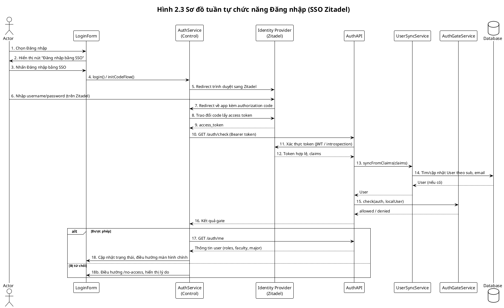
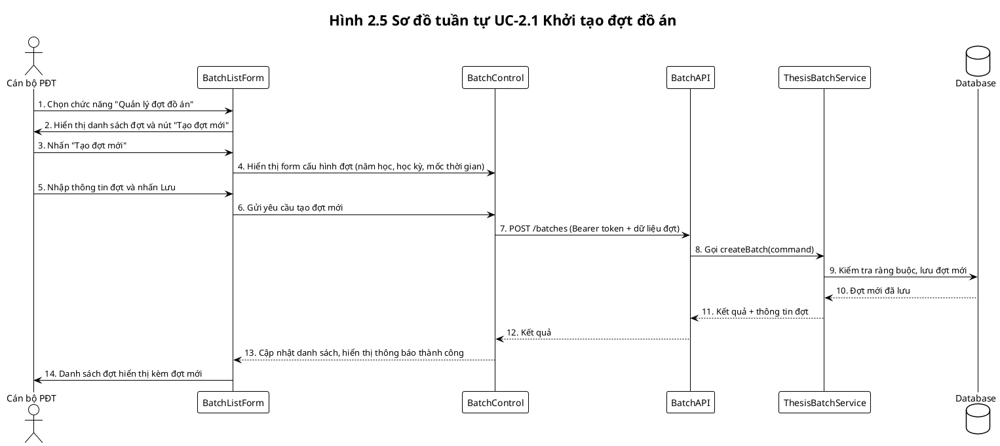
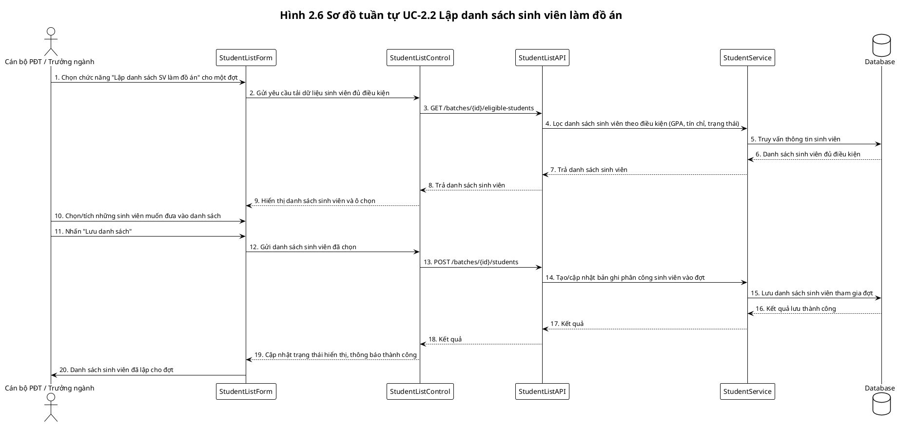

# 2.2 Thực thi trường hợp sử dụng (Use-case realizations)

## 2.2.1 Các biểu đồ tuần tự (Sequence diagrams)

Mục này mô tả luồng tương tác giữa các thành phần khi thực thi use case, dưới dạng sơ đồ tuần tự. Mỗi sơ đồ đi kèm luồng lời chức năng theo định dạng: 1. Chọn ... 2. Hiển thị ... 3. ... ThesisHub sử dụng **SSO qua Zitadel**; mọi request API đều mang Bearer token và được xác thực qua Identity Provider.

### a) Sơ đồ tuần tự chung

Luồng tổng quát áp dụng cho đa số chức năng nghiệp vụ (sau khi người dùng đã đăng nhập qua SSO).



**Luồng lời chức năng (1–9):**

1. **Actor** chọn một chức năng trên giao diện (Form).
2. **Form** hiển thị màn hình tương ứng và cho phép người dùng nhập dữ liệu.
3. Người dùng thực hiện thao tác (nhập dữ liệu, nhấn nút thực hiện).
4. **Form** gửi yêu cầu tới **Control** kèm Bearer token (đã có từ phiên đăng nhập SSO).
5. **Control** kiểm tra tính hợp lệ dữ liệu, tạo request gọi tới **API** kèm header `Authorization: Bearer <token>`.
6. **API** nhận request, xác thực token với **Identity Provider** (JWT hoặc introspection). Nếu hợp lệ, tiếp tục.
7. **API** gọi các phương thức trên **Entity/Repository** để thực hiện nghiệp vụ.
8. **Entity/Repository** truy xuất hoặc cập nhật dữ liệu trong **Database**; kết quả trả về qua API → Control → Form.
9. **Form** cập nhật giao diện, hiển thị thông báo cho người dùng (thành công/thất bại).

---

### b) Ví dụ: UC-1.1 Đăng nhập hệ thống

ThesisHub không tự quản lý mật khẩu; xác thực được ủy quyền cho **Identity Provider (Zitadel)**. Người dùng đăng nhập trên trang Zitadel, nhận token và gửi kèm mọi request API.

#### Sơ đồ tuần tự chức năng Đăng nhập



**Luồng lời chức năng (1–14):**

1. **Actor** chọn chức năng "Đăng nhập" trên giao diện.
2. **LoginForm** hiển thị màn hình đăng nhập với nút "Đăng nhập bằng SSO".
3. Actor nhấn nút "Đăng nhập bằng SSO".
4. **LoginForm** gọi **AuthService**; AuthService thực hiện `initCodeFlow()` và chuyển hướng trình duyệt tới **Identity Provider (Zitadel)**.
5. Actor nhập tên đăng nhập và mật khẩu **trên trang Zitadel** (không phải trên Form của ThesisHub).
6. Zitadel xác thực và redirect về ứng dụng kèm **authorization code** (OAuth2 Authorization Code Flow).
7. Thư viện angular-oauth2-oidc trao đổi code lấy **access token**, lưu token phía client.
8. **AuthService** gửi request tới **AuthAPI** (`GET /api/auth/check`) kèm header `Authorization: Bearer <token>`.
9. **Spring Security** (OAuth2 Resource Server) xác minh token với Zitadel: giải mã/kiểm chữ ký JWT hoặc gọi introspection endpoint.
10. Nếu token hợp lệ, **AuthController** trích xuất claims, gọi **UserSyncService** để tìm/cập nhật **User** trong **Database** theo `sub`/email.
11. **AuthGateService** kiểm tra: User tồn tại trong hệ thống, trạng thái ACTIVE, có vai trò nội bộ khớp với vai trò trong token.
12. AuthAPI trả về kết quả gate (`allowed`/`denied`) cho AuthService.
13. Nếu được phép: AuthService gọi `GET /api/auth/me` lấy thông tin đầy đủ (local_user_id, roles, faculty, major), cập nhật trạng thái đăng nhập và điều hướng tới màn hình chính theo vai trò.
14. Nếu bị từ chối (chưa có trong hệ thống, bị khóa, chưa gán vai trò): AuthService điều hướng tới `/no-access` và hiển thị lý do.

---

Các use case khác (Đăng ký đề tài, Nộp đề cương, Đăng ký bảo vệ, Xếp lịch bảo vệ, v.v.) sẽ được mô tả theo cùng mẫu: mỗi chức năng có **một sơ đồ tuần tự** với luồng lời chức năng 1. Chọn ... 2. Hiển thị ... 3. ...


### c) Ví dụ: UC-1.2 Đăng xuất hệ thống

Use case Đăng xuất chỉ xóa trạng thái phía client và chuyển hướng người dùng về màn hình đăng nhập; backend là stateless, không cần gọi API riêng để hủy phiên.

```plantuml
@startuml Hinh 2.4 - So do tuan tu Dang xuat
!theme plain
title Hình 2.4 Sơ đồ tuần tự chức năng Đăng xuất

actor Actor
participant "AnyScreen" as Screen
participant "AuthService" as Auth
participant "Identity Provider
(Zitadel)" as IdP

Actor -> Screen: 1. Chọn Đăng xuất
Screen -> Auth: 2. Gọi logout()
Auth -> Auth: 3. Xóa trạng thái local (currentUser, token trong bộ nhớ)
Auth -> IdP: 4. logOut() / end-session (redirect sang Zitadel nếu cấu hình)
IdP --> Actor: 5. Redirect về trang đăng nhập của hệ thống

@enduml
```

**Luồng lời chức năng (1–5):**

1. Người dùng chọn chức năng "Đăng xuất" trên bất kỳ màn hình nào trong hệ thống.
2. Giao diện gọi **AuthService.logout()**.
3. **AuthService** xóa toàn bộ trạng thái đăng nhập phía client (currentUser, activeRole, lưu trữ session liên quan).
4. **AuthService** gọi hàm `oauthService.logOut()` để chuyển hướng tới endpoint đăng xuất của Zitadel (nếu được cấu hình), kết thúc phiên SSO.
5. Trình duyệt được chuyển hướng về trang đăng nhập của ThesisHub, người dùng có thể đăng nhập lại.

---

### d) Ví dụ: UC-2.1 Khởi tạo đợt đồ án



**Luồng lời chức năng (1–14):**

1. Cán bộ Phòng Đào tạo chọn chức năng "Quản lý đợt đồ án".
2. Hệ thống hiển thị danh sách các đợt hiện có và nút "Tạo đợt mới".
3. Người dùng nhấn nút "Tạo đợt mới".
4. Hệ thống hiển thị form cấu hình đợt (năm học, học kỳ, các mốc thời gian, trạng thái).
5. Người dùng nhập thông tin đợt và nhấn Lưu.
6. Form gửi yêu cầu tạo đợt mới tới lớp điều khiển.
7. Lớp điều khiển gọi API `POST /batches` kèm Bearer token và dữ liệu đợt.
8. API gọi service nghiệp vụ để kiểm tra ràng buộc và tạo đối tượng đợt đồ án.
9. Service ghi thông tin đợt mới vào cơ sở dữ liệu.
10. Cơ sở dữ liệu trả kết quả lưu thành công.
11. Service trả về thông tin đợt mới cho API.
12. API trả kết quả cho lớp điều khiển.
13. Lớp điều khiển yêu cầu Form cập nhật danh sách đợt và hiển thị thông báo thành công.
14. Người dùng nhìn thấy đợt mới trong danh sách.

---

### e) Ví dụ: UC-2.2 Lập danh sách sinh viên làm đồ án



**Luồng lời chức năng (1–20):**

1. Cán bộ PĐT hoặc Trưởng ngành chọn chức năng "Lập danh sách SV làm đồ án" cho một đợt cụ thể.
2. Hệ thống gửi yêu cầu tải danh sách sinh viên đủ điều kiện.
3. Lớp điều khiển gọi API `GET /batches/{id}/eligible-students`.
4. API gọi service để áp dụng các điều kiện (GPA, tín chỉ, trạng thái).
5. Service truy vấn cơ sở dữ liệu lấy thông tin sinh viên.
6. Cơ sở dữ liệu trả về danh sách sinh viên thỏa điều kiện.
7. Service trả danh sách này cho API.
8. API trả danh sách cho lớp điều khiển.
9. Lớp điều khiển yêu cầu Form hiển thị bảng sinh viên với ô chọn.
10. Người dùng chọn (tích) các sinh viên muốn đưa vào danh sách làm đồ án.
11. Người dùng nhấn "Lưu danh sách".
12. Form gửi danh sách sinh viên đã chọn tới lớp điều khiển.
13. Lớp điều khiển gọi API `POST /batches/{id}/students` để lưu danh sách.
14. API gọi service tạo/cập nhật bản ghi phân công sinh viên vào đợt.
15. Service ghi dữ liệu danh sách sinh viên tham gia đợt vào cơ sở dữ liệu.
16. Cơ sở dữ liệu trả kết quả lưu thành công.
17. Service trả kết quả cho API.
18. API trả kết quả cho lớp điều khiển.
19. Lớp điều khiển yêu cầu Form cập nhật giao diện và hiển thị thông báo thành công.
20. Người dùng nhìn thấy danh sách sinh viên đã lập cho đợt đồ án.

---

Các use case khác (Đăng ký đề tài, Nộp đề cương, Đăng ký bảo vệ, Xếp lịch bảo vệ, v.v.) có thể được xây dựng tương tự theo mẫu trên.

---

## 2.2.2 Góc nhìn của các lớp trong hệ thống (Views of participating classes)

Mục này trình bày các lớp chính tham gia vào việc thực thi các use case, ánh xạ từ các đối tượng trừu tượng trong mục 2.1.2.

### Lớp tham gia luồng chung

| Thành phần | Vai trò | Liên quan |
|------------|---------|-----------|
| **Actor** | Tác nhân sử dụng hệ thống (Sinh viên, Giảng viên, PĐT, Trưởng ngành) | Form |
| **Form** | Giao diện (UI), thu thập nhập liệu, hiển thị kết quả | Actor, Control |
| **Control** | Điều phối luồng, gọi API | Form, API |
| **API** | Điểm truy cập dịch vụ, xác thực token, gọi Entity/Repository | Control, IdP, Entity |
| **Identity Provider** | Zitadel; cung cấp token, xác minh token | API |
| **Entity/Repository** | Đối tượng nghiệp vụ, truy xuất DB | API, Database |
| **Database** | Lưu trữ dữ liệu | Entity |

### Lớp tham gia UC-1.1 Đăng nhập

| Thành phần | Vai trò |
|------------|---------|
| **LoginForm** | Màn hình đăng nhập, nút "Đăng nhập bằng SSO" |
| **AuthService** | Control frontend: initCodeFlow, gọi /auth/check, /auth/me |
| **Identity Provider (Zitadel)** | Nhận credentials, cấp token; API xác minh token |
| **AuthController / AuthAPI** | `/api/auth/check`, `/api/auth/me`; trích claims, sync user |
| **UserSyncService** | Đồng bộ User nội bộ từ claims (sub, email) |
| **AuthGateService** | Kiểm tra User trong hệ thống, ACTIVE, vai trò khớp |
| **User** | Entity người dùng nội bộ (không lưu mật khẩu) |
| **Database** | Lưu User, vai trò, dữ liệu nghiệp vụ |
