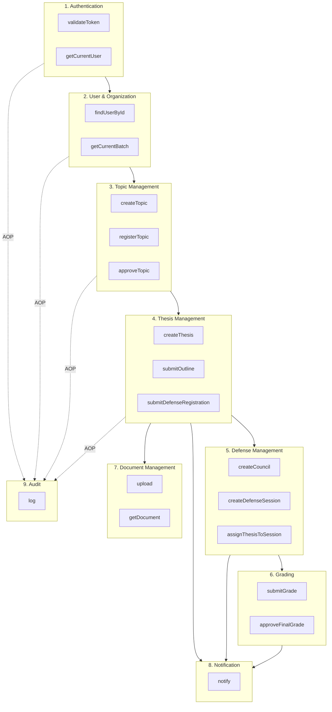

# 3.1.2 Xác định các hệ thống con và giao diện (Identify subsystems and interfaces)

Phần này mô tả cách phân rã hệ thống ThesisHub thành các hệ thống con (subsystem) và các giao diện (interface) giữa chúng, nhằm hỗ trợ thiết kế kiến trúc mô-đun hóa, dễ bảo trì và mở rộng.

---

## 1. Khái niệm hệ thống con và giao diện

| Khái niệm | Định nghĩa |
|-----------|------------|
| **Hệ thống con (Subsystem)** | Đơn vị logic hoặc vật lý trong hệ thống, đảm nhiệm một nhóm chức năng nghiệp vụ có liên quan chặt chẽ. Có trách nhiệm rõ ràng và giao tiếp với các hệ thống con khác thông qua giao diện định nghĩa sẵn. |
| **Giao diện (Interface)** | Tập hợp các thao tác (operations) mà hệ thống con cung cấp hoặc yêu cầu từ hệ thống con khác. Đảm bảo tính tách biệt (decoupling) và cho phép thay đổi nội bộ mà không ảnh hưởng phần còn lại của hệ thống. |

---

## 2. Danh sách các hệ thống con

Dựa trên các đối tượng trừu tượng chính (key abstractions), use case và phân tích kiến trúc, hệ thống ThesisHub được chia thành các hệ thống con sau:

| STT | Hệ thống con | Vai trò | Use case liên quan |
|-----|--------------|---------|--------------------|
| 1 | **Xác thực (Authentication)** | Quản lý đăng nhập, đăng xuất, xác thực người dùng qua SSO và đồng bộ thông tin với IdP. | UC-1.1, UC-1.2 |
| 2 | **Quản lý người dùng & Tổ chức (User & Organization)** | Quản lý thông tin người dùng, vai trò, đơn vị (khoa, ngành) và đợt đồ án. | UC-2.1, UC-2.2 |
| 3 | **Quản lý đề tài (Topic Management)** | Quản lý đề tài mở, đăng ký đề tài, đề xuất đề tài của sinh viên và duyệt đề tài. | UC-3.1, UC-3.2 |
| 4 | **Quản lý đồ án (Thesis Management)** | Quản lý vòng đời đồ án, đề cương, tiến độ và đăng ký bảo vệ. | UC-4.1 – UC-4.4, UC-5.1, UC-5.2 |
| 5 | **Quản lý bảo vệ (Defense Management)** | Quản lý hội đồng, phiên bảo vệ, phân công đồ án vào phiên và chuẩn bị hồ sơ hội đồng. | UC-6.1 – UC-6.4 |
| 6 | **Chấm điểm (Grading)** | Quản lý điểm GVHD, điểm hội đồng, tính điểm tổng, xếp loại và chốt kết quả. | UC-6.5, UC-7.3 |
| 7 | **Quản lý tài liệu (Document Management)** | Lưu trữ, truy xuất và quản lý file (đề cương, báo cáo, mã nguồn, slide). | UC-4.1, UC-5.1, UC-6.3, UC-7.1, UC-7.4 |
| 8 | **Thông báo (Notification)** | Gửi thông báo cho người dùng (realtime, in-app). | Hỗ trợ nhiều UC |
| 9 | **Kiểm toán (Audit)** | Ghi nhật ký thao tác người dùng để phục vụ tra cứu và tuân thủ. | Hỗ trợ nhiều UC |

---

## 3. Mô tả chi tiết các hệ thống con

### 3.1. Hệ thống con Xác thực (Authentication Subsystem)

| Loại | Nội dung |
|------|----------|
| **Trách nhiệm** | Xác thực người dùng qua OAuth2/OIDC với Zitadel SSO; xác thực và ủy quyền cho mỗi yêu cầu API; đồng bộ thông tin người dùng từ IdP vào DB. |

| Thao tác (Giao diện cung cấp) | Mô tả |
|-------------------------------|-------|
| `validateToken(accessToken)` | Kiểm tra token hợp lệ, trả về user/claims. |
| `getCurrentUser()` | Trả về người dùng hiện tại từ context bảo mật. |
| `hasRole(roleCode)` | Kiểm tra người dùng có vai trò chỉ định hay không. |

| Thành phần (Giao diện sử dụng) | Mục đích |
|--------------------------------|----------|
| IdP (Zitadel) | Validate token, lấy user info. |
| User & Organization | Đồng bộ thông tin người dùng. |

---

### 3.2. Hệ thống con Quản lý người dùng & Tổ chức (User & Organization Subsystem)

| Loại | Nội dung |
|------|----------|
| **Trách nhiệm** | CRUD người dùng (sinh viên, giảng viên, cán bộ PĐT, trưởng ngành); quản lý cấu trúc tổ chức (trường, khoa, ngành, năm học); quản lý đợt đồ án (ThesisBatch) và mốc thời gian. |

| Thao tác (Giao diện cung cấp) | Mô tả |
|-------------------------------|-------|
| `findUserById(id)` | Tìm người dùng theo ID. |
| `findStudentsByBatch(batchId)` | Lấy danh sách sinh viên thuộc đợt đồ án. |
| `getCurrentBatch()` | Lấy đợt đồ án hiện tại đang mở. |
| `isEligibleForThesis(studentId)` | Kiểm tra sinh viên đủ điều kiện làm đồ án hay không. |

| Thành phần (Giao diện sử dụng) | Mục đích |
|--------------------------------|----------|
| Authentication | Nhận thông tin người dùng từ IdP. |
| Topic Management, Thesis Management, Defense, Grading | Truy xuất thông tin người dùng và đợt đồ án. |

---

### 3.3. Hệ thống con Quản lý đề tài (Topic Management Subsystem)

| Loại | Nội dung |
|------|----------|
| **Trách nhiệm** | Đăng ký đề tài mở (giảng viên); chọn đề tài có sẵn hoặc đề xuất đề tài mới (sinh viên); duyệt hoặc từ chối đề tài đề xuất. |

| Thao tác (Giao diện cung cấp) | Mô tả |
|-------------------------------|-------|
| `createTopic(batchId, request)` | Tạo đề tài mới trong đợt đồ án. |
| `registerTopic(registrationRequest)` | Đăng ký/chọn đề tài (sinh viên). |
| `approveTopic(registrationId, approved)` | Duyệt hoặc từ chối đăng ký đề tài. |
| `findTopicsByBatch(batchId, filters)` | Tìm kiếm đề tài theo đợt và bộ lọc. |

| Thành phần (Giao diện sử dụng) | Mục đích |
|--------------------------------|----------|
| User & Organization | Kiểm tra đợt đồ án, danh sách sinh viên. |
| Thesis Management | Tạo đồ án từ đăng ký đề tài được duyệt. |

---

### 3.4. Hệ thống con Quản lý đồ án (Thesis Management Subsystem)

| Loại | Nội dung |
|------|----------|
| **Trách nhiệm** | Tạo đồ án từ đăng ký đề tài được duyệt; quản lý đề cương (nộp, duyệt); quản lý cập nhật tiến độ; quản lý đăng ký bảo vệ và hồ sơ đăng ký bảo vệ. |

| Thao tác (Giao diện cung cấp) | Mô tả |
|-------------------------------|-------|
| `createThesis(topicRegistrationId)` | Tạo đồ án từ đăng ký đề tài đã duyệt. |
| `submitOutline(thesisId, file)` | Nộp đề cương. |
| `approveOutline(outlineId, approved)` | Duyệt hoặc từ chối đề cương. |
| `updateProgress(thesisId, progressData)` | Cập nhật tiến độ. |
| `submitDefenseRegistration(thesisId, files)` | Nộp hồ sơ đăng ký bảo vệ. |
| `approveDefenseRegistration(registrationId, approved)` | Duyệt hoặc từ chối đăng ký bảo vệ. |

| Thành phần (Giao diện sử dụng) | Mục đích |
|--------------------------------|----------|
| Topic Management | Lấy thông tin đề tài và đăng ký. |
| Document Management | Lưu và truy xuất file. |
| Defense Management | Kiểm tra trạng thái đồ án đủ điều kiện bảo vệ. |

---

### 3.5. Hệ thống con Quản lý bảo vệ (Defense Management Subsystem)

| Loại | Nội dung |
|------|----------|
| **Trách nhiệm** | Tạo hội đồng, phân công thành viên; tạo phiên bảo vệ, xếp lịch; gán đồ án vào phiên bảo vệ; chuẩn bị hồ sơ phục vụ hội đồng. |

| Thao tác (Giao diện cung cấp) | Mô tả |
|-------------------------------|-------|
| `createCouncil(request)` | Tạo hội đồng bảo vệ. |
| `createDefenseSession(batchId, sessionData)` | Tạo phiên bảo vệ. |
| `assignThesisToSession(thesisId, sessionId, order)` | Gán đồ án vào phiên bảo vệ. |
| `exportCouncilReport(sessionId)` | Xuất hồ sơ phục vụ hội đồng. |

| Thành phần (Giao diện sử dụng) | Mục đích |
|--------------------------------|----------|
| Thesis Management | Kiểm tra trạng thái đồ án (READY_FOR_DEFENSE). |
| User & Organization | Lấy thông tin giảng viên, phòng. |
| Grading | Chuyển sang chấm điểm sau khi kết thúc phiên. |

---

### 3.6. Hệ thống con Chấm điểm (Grading Subsystem)

| Loại | Nội dung |
|------|----------|
| **Trách nhiệm** | Nhập điểm GVHD, điểm hội đồng; tính điểm tổng và xếp loại; chốt kết quả cuối cùng của đồ án. |

| Thao tác (Giao diện cung cấp) | Mô tả |
|-------------------------------|-------|
| `submitGrade(thesisId, gradeType, score)` | Nhập điểm theo loại (advisor/council). |
| `approveFinalGrade(thesisId, finalScore, grade)` | Chốt điểm cuối và xếp loại. |
| `calculateFinalScore(thesisId)` | Tính điểm tổng theo quy chế. |

| Thành phần (Giao diện sử dụng) | Mục đích |
|--------------------------------|----------|
| Thesis Management | Cập nhật trạng thái đồ án sau khi chốt điểm. |
| Notification | Thông báo kết quả cho sinh viên. |

---

### 3.7. Hệ thống con Quản lý tài liệu (Document Management Subsystem)

| Loại | Nội dung |
|------|----------|
| **Trách nhiệm** | Lưu trữ file tải lên (đề cương, báo cáo, mã nguồn, slide); truy xuất file theo ID, loại tài liệu, đồ án. |

| Thao tác (Giao diện cung cấp) | Mô tả |
|-------------------------------|-------|
| `upload(file, type, entityRef)` | Lưu file, trả về path/ID. |
| `getDocument(id)` | Lấy thông tin và nội dung file. |
| `listByThesis(thesisId)` | Liệt kê tài liệu theo đồ án. |

| Thành phần (Giao diện sử dụng) | Mục đích |
|--------------------------------|----------|
| Thesis Management, Defense | Lưu và truy xuất tài liệu. |

---

### 3.8. Hệ thống con Thông báo (Notification Subsystem)

| Loại | Nội dung |
|------|----------|
| **Trách nhiệm** | Gửi thông báo in-app (WebSocket); lưu lịch sử thông báo để tra cứu. |

| Thao tác (Giao diện cung cấp) | Mô tả |
|-------------------------------|-------|
| `notify(userIds, type, payload)` | Gửi thông báo đến danh sách người dùng. |

| Thành phần (Giao diện sử dụng) | Mục đích |
|--------------------------------|----------|
| Các hệ thống con nghiệp vụ (Topic, Thesis, Defense, Grading) | Gọi khi có sự kiện cần thông báo (duyệt đề tài, lịch bảo vệ, kết quả). |

---

### 3.9. Hệ thống con Kiểm toán (Audit Subsystem)

| Loại | Nội dung |
|------|----------|
| **Trách nhiệm** | Ghi nhật ký mọi thao tác quan trọng (ai, làm gì, khi nào); tra cứu nhật ký theo người dùng, thời gian, loại thao tác. |

| Thao tác (Giao diện cung cấp) | Mô tả |
|-------------------------------|-------|
| `log(action, entityType, entityId, details)` | Ghi log thao tác. |
| `query(filters)` | Tra cứu nhật ký theo bộ lọc. |

| Thành phần (Giao diện sử dụng) | Mục đích |
|--------------------------------|----------|
| Các hệ thống con | Gọi khi thực hiện thao tác cần audit (thường qua AOP). |

---

## 4. Biểu đồ các hệ thống con và giao diện

[Chèn Hình 3.1 Biểu đồ hệ thống con và giao diện tại đây]

Hình 3.1 Biểu đồ phụ thuộc giữa các hệ thống con

---

## 5. Bảng ánh xạ hệ thống con – gói mã nguồn

| Hệ thống con | Package / Module mã nguồn |
|--------------|---------------------------|
| 1. Authentication | `auth` |
| 2. User & Organization | `user`, `organization`, `batch` |
| 3. Topic Management | `topic` |
| 4. Thesis Management | `thesis` |
| 5. Defense Management | `defense` |
| 6. Grading | `grading` |
| 7. Document Management | `document` |
| 8. Notification | `notification` |
| 9. Audit | `audit` |
| Cross-cutting | `common`, `config` |

---

## 6. Bảng tổng hợp phụ thuộc giữa các hệ thống con

| Hệ thống con | Phụ thuộc vào (Giao diện sử dụng) |
|--------------|-----------------------------------|
| 1. Authentication | IdP (Zitadel), User & Organization |
| 2. User & Organization | Authentication |
| 3. Topic Management | User & Organization |
| 4. Thesis Management | Topic Management, Document Management, Defense Management |
| 5. Defense Management | Thesis Management, User & Organization |
| 6. Grading | Thesis Management, Notification |
| 7. Document Management | (Không phụ thuộc hệ thống con khác) |
| 8. Notification | (Không phụ thuộc hệ thống con khác) |
| 9. Audit | (Được gọi bởi tất cả, qua AOP) |

---

## 7. Tóm tắt

| Nội dung | Chi tiết |
|----------|----------|
| Số hệ thống con | 9 hệ thống con chính |
| Đặc điểm | Mỗi hệ thống con có trách nhiệm rõ ràng, giao tiếp qua giao diện xác định |
| Lợi ích | Hỗ trợ thiết kế mô-đun, dễ bảo trì và mở rộng |
| Ánh xạ mã nguồn | Tương ứng trực tiếp với cấu trúc package backend (`auth`, `user`, `topic`, `thesis`, `defense`, `grading`, `document`, `notification`, `audit`) |
