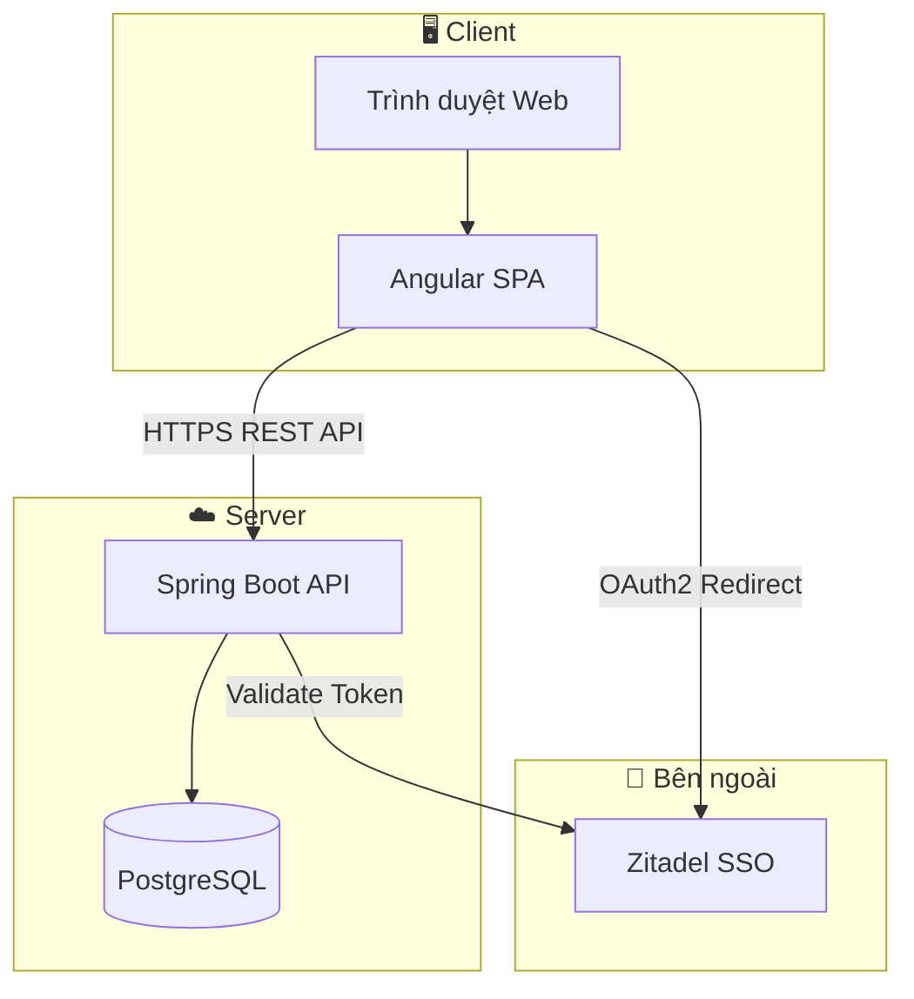

# 4. CÀI ĐẶT (IMPLEMENTATION)

Phần này mô tả các quyết định lựa chọn công nghệ và cấu trúc mã nguồn của hệ thống Quản lý Đồ án Tốt nghiệp (ThesisHub).

---

## 4.1 Lựa chọn công nghệ

### Sơ đồ kiến trúc hệ thống



**Mô tả sơ đồ**

- **Client**: Người dùng truy cập qua trình duyệt, chạy ứng dụng Angular SPA (giao diện, form, routing).
- **Server**: Spring Boot cung cấp REST API, kết nối PostgreSQL để lưu trữ dữ liệu.
- **Zitadel**: Hệ thống SSO (IdP) dùng để đăng nhập. Trình duyệt được chuyển hướng đến Zitadel để xác thực; sau khi đăng nhập, Zitadel trả về token cho Angular, và Spring Boot kiểm tra token trước khi xử lý API.

Luồng: **User → Browser (Angular) → API Server ↔ Database**; **Angular ↔ Zitadel** (login), **API Server → Zitadel** (validate token).

---

### Giới thiệu các công nghệ sử dụng

Bảng tổng quan:

| STT | Công nghệ | Vai trò | Phiên bản |
|-----|-----------|---------|-----------|
| A | Spring Boot | Backend framework | 3.5.11 |
| B | Angular | Frontend framework | 21 |
| C | PostgreSQL | Cơ sở dữ liệu | - |
| D | Zitadel & OAuth2/OIDC | Xác thực, SSO | - |
| E | Spring Data JPA / Hibernate | ORM, truy vấn DB | (Boot) |
| F | Angular Material & Tailwind CSS | Giao diện người dùng | 21, 4.1.12 |
| G | Công nghệ bổ trợ | MapStruct, Lombok, SpringDoc, Caffeine, Liquibase, WebSocket | - |

---

### 4.1.1 Spring Boot (Công nghệ A)

**Các thành phần sử dụng**

- Spring Boot Web (REST API)
- Spring Security
- Spring Data JPA
- Spring OAuth2 Resource Server & Client
- Spring WebSocket
- Spring Cache, Validation, AOP, Actuator

**Lý do sử dụng**

- Nền tảng phổ biến để xây dựng REST API và microservice bằng Java.
- Tích hợp sẵn Security, JPA, OAuth2, dễ cấu hình và triển khai.
- Hệ sinh thái rộng, nhiều tài liệu và cộng đồng hỗ trợ.

**Ưu điểm**

- Cấu hình ít, convention-over-configuration.
- Tích hợp nhiều công nghệ (DB, bảo mật, cache) trong cùng một stack.
- Hỗ trợ embed server (Tomcat), triển khai đơn giản.

**Nhược điểm**

- Bundle tương đối lớn, startup chậm hơn so với framework nhẹ.
- Cần hiểu rõ Spring (DI, AOP) để tối ưu và debug.

---

### 4.1.2 Angular (Công nghệ B)

**Các thành phần sử dụng**

- Angular Core, Router, Forms
- Angular Material (CDK, components)
- RxJS
- Angular SSR (Server-Side Rendering)
- TypeScript 5.9

**Lý do sử dụng**

- Framework SPA mạnh mẽ, phù hợp ứng dụng doanh nghiệp phức tạp.
- Hỗ trợ TypeScript, kiểu dữ liệu rõ ràng, dễ bảo trì.
- Dependency Injection, routing, form validation có sẵn.

**Ưu điểm**

- Cấu trúc thư mục rõ ràng, phù hợp dự án lớn.
- Tích hợp Material Design, xây dựng giao diện nhanh.
- Angular CLI hỗ trợ generate, build, test.

**Nhược điểm**

- Độ dốc học tập cao, cần thời gian làm quen.
- Bundle size lớn hơn một số framework nhẹ như React, Vue.

---

### 4.1.3 PostgreSQL (Công nghệ C)

**Các thành phần**

- PostgreSQL Server
- JDBC Driver (org.postgresql)

**Lý do sử dụng**

- Hệ quản trị CSDL quan hệ mã nguồn mở, hỗ trợ ACID.
- Phù hợp dữ liệu có quan hệ phức tạp (đồ án, đề tài, sinh viên, giảng viên).
- Hỗ trợ JSON, full-text search, phù hợp mở rộng sau này.

**Ưu điểm**

- Miễn phí, ổn định, hiệu năng tốt.
- Hỗ trợ transaction, constraint, index linh hoạt.
- Tích hợp tốt với JPA/Hibernate và Liquibase.

**Nhược điểm**

- Việc sharding, cluster phức tạp hơn NoSQL.
- Cần cấu hình và bảo trì thủ công cho production.

---

### 4.1.4 Zitadel & OAuth2/OIDC (Công nghệ D)

**Các thành phần**

- Zitadel (Identity Provider)
- Spring OAuth2 Resource Server (validate token)
- Spring OAuth2 Client (chuyển hướng login)
- angular-oauth2-oidc (phía client)

**Lý do sử dụng**

- Trường có thể đã dùng Zitadel cho SSO; tích hợp để tái sử dụng danh tính.
- OAuth2/OIDC là chuẩn hiện đại cho xác thực, hỗ trợ SSO, single logout.
- Tách biệt logic xác thực khỏi ứng dụng, tăng bảo mật.

**Ưu điểm**

- SSO một lần đăng nhập cho nhiều ứng dụng.
- Mã nguồn mở, tương thích OIDC.
- Quản lý user, role tập trung tại IdP.

**Nhược điểm**

- Phụ thuộc IdP bên ngoài; IdP lỗi thì user không đăng nhập được.
- Cần đồng bộ user local với IdP (sync thông tin, role).

---

### 4.1.5 Spring Data JPA & Hibernate (Công nghệ E)

**Các thành phần**

- spring-boot-starter-data-jpa
- Hibernate (qua Spring Boot)
- Liquibase (migration schema)

**Lý do sử dụng**

- Giảm SQL thủ công, tập trung vào logic nghiệp vụ.
- Spring Data JPA cung cấp phương thức truy vấn theo tên, dễ đọc.
- Hibernate xử lý ánh xạ object–relational, lazy loading, cache L2.

**Ưu điểm**

- Giảm boilerplate CRUD.
- Hỗ trợ pagination, sorting, specification.
- Tích hợp tốt với Spring Boot.

**Nhược điểm**

- N+1 query nếu không cẩn thận (eager/lazy loading).
- Truy vấn phức tạp có thể cần native SQL hoặc query tối ưu.

---

### 4.1.6 Angular Material & Tailwind CSS (Công nghệ F)

**Các thành phần**

- Angular Material (table, form, dialog, snackbar, …)
- Angular CDK (accessibility, overlay, …)
- Tailwind CSS (utility classes)
- Motion (animations)

**Lý do sử dụng**

- Material cung cấp component chuẩn, đẹp, accessible.
- Tailwind giúp tùy chỉnh layout và style nhanh, không cần viết nhiều CSS riêng.
- Kết hợp Material + Tailwind tạo giao diện nhất quán và linh hoạt.

**Ưu điểm**

- Material: thư viện component đầy đủ, theo Material Design.
- Tailwind: responsive, tùy biến màu/spacing, giảm CSS dư thừa.

**Nhược điểm**

- Material: phong cách có thể hơi “đồng bộ”, cần theme để khác biệt.
- Tailwind: class dài trong HTML, cần làm quen utility-first.

---

### 4.1.7 Công nghệ bổ trợ (Công nghệ G)

| Công nghệ | Thành phần | Lý do sử dụng | Ưu điểm | Nhược điểm |
|-----------|------------|---------------|---------|-------------|
| **MapStruct** | Chuyển Entity ↔ DTO | Giảm code mapping thủ công | Compile-time, hiệu năng tốt | Cần cấu hình annotation processor |
| **Lombok** | @Data, @Builder, @Slf4j | Giảm boilerplate getter/setter, builder | Code gọn, ít lặp | Phụ thuộc IDE/plugin |
| **SpringDoc** | OpenAPI, Swagger UI | Tài liệu API tự động | Tích hợp tốt, cập nhật theo code | Mô tả chi tiết cần annotation |
| **Caffeine** | Cache in-memory | Cache dữ liệu ít thay đổi (majors, faculties) | Nhanh, cấu hình đơn giản | Chỉ dùng trong 1 instance, không chia sẻ giữa nhiều server |
| **Liquibase** | Migration DB | Quản lý thay đổi schema có version | Changelog rõ ràng, rollback | Cần cấu hình changelog |
| **Spring WebSocket** | Thông báo real-time | Cập nhật thông báo không cần reload | Trải nghiệm real-time | Cần xử lý kết nối, reconnect |
| **Jackson** | JSON, JSR310 | Serialize/deserialize API | Chuẩn de facto trong Java | Tùy biến sâu cần cấu hình |
| **JUnit 5 & Spring Security Test** | Unit/Integration test | Đảm bảo chất lượng, test API kèm Security | Tích hợp Spring, hỗ trợ mock | Setup test cần cấu hình |

---

## 4.2 Cấu trúc mã nguồn

### 4.2.1 Tổng quan

Dự án sử dụng kiến trúc **monorepo** với hai ứng dụng chính:

```
sad_project/
├── backend/          # Spring Boot REST API
├── frontend/         # Angular SPA
└── docs/             # Tài liệu dự án
```

Backend cung cấp REST API, frontend là ứng dụng SPA gọi API qua HTTP. Xác thực thực hiện qua OAuth2/OIDC (Zitadel).

---

### 4.2.2 Cấu trúc Backend

Backend được tổ chức theo **module chức năng** với kiến trúc lớp: Controller → Service → Repository.

#### Cây thư mục chính

```
backend/
├── src/main/java/com/phenikaa/thesis/
│   ├── auth/                    # Xác thực SSO, đồng bộ user
│   │   ├── controller/
│   │   ├── dto/
│   │   └── service/
│   │
│   ├── user/                    # Quản lý người dùng (SV, GV)
│   │   ├── controller/
│   │   ├── dto/, entity/
│   │   ├── repository/, service/
│   │   ├── mapper/
│   │   └── service/importing/   # Import Excel SV/GV
│   │
│   ├── organization/            # Khoa, ngành, niên khóa
│   │   ├── controller/
│   │   ├── dto/, entity/
│   │   ├── repository/, service/
│   │   └── validator/
│   │
│   ├── batch/                   # Đợt đồ án
│   │   ├── controller/
│   │   ├── dto/, entity/
│   │   ├── repository/, service/
│   │   └── mapper/, validator/
│   │
│   ├── topic/                   # Đề tài và đăng ký đề tài
│   │   ├── controller/
│   │   ├── dto/, entity/
│   │   ├── repository/, service/
│   │   └── mapper/, validator/
│   │
│   ├── thesis/                  # Đồ án, đề cương, tiến độ, đăng ký bảo vệ
│   │   ├── controller/          # Thesis, Outline, Progress, Defense
│   │   ├── dto/, entity/
│   │   ├── repository/, service/
│   │   └── mapper/, validator/
│   │
│   ├── defense/                 # Hội đồng, phiên bảo vệ (entity, repository)
│   ├── grading/                 # Điểm, chốt điểm (entity, repository)
│   ├── document/                # Tài liệu (entity, repository)
│   ├── notification/            # Thông báo
│   ├── audit/                   # Audit log
│   ├── dashboard/               # Thống kê tổng quan
│   ├── common/                  # Dùng chung
│   │   ├── dto/                 # ApiResponse, ...
│   │   ├── entity/              # BaseEntity
│   │   ├── exception/           # GlobalExceptionHandler
│   │   └── util/                # SecurityUtils, ...
│   └── config/                  # SecurityConfig, CORS, ...
│
├── src/main/resources/
│   ├── application.yml
│   └── db/
│       ├── init.sql
│       └── changelog/migrations/
│
└── pom.xml
```

#### Mô tả các module

| Module | Chức năng |
|--------|-----------|
| **auth** | Kiểm tra quyền truy cập, đồng bộ user từ SSO, `/api/auth/*` |
| **user** | CRUD người dùng, import SV/GV, profile, giảng viên |
| **organization** | Khoa, ngành, niên khóa |
| **batch** | Đợt đồ án (tạo, kích hoạt, đóng) |
| **topic** | Đề tài, đăng ký đề tài |
| **thesis** | Đồ án, đề cương, tiến độ, đăng ký bảo vệ |
| **defense** | Hội đồng, phiên bảo vệ (đang mở rộng) |
| **grading** | Điểm, chốt điểm (đang mở rộng) |
| **notification** | Thông báo real-time |
| **audit** | Lịch sử thao tác |
| **dashboard** | Thống kê |
| **common** | DTO, exception, util dùng chung |
| **config** | Cấu hình bảo mật, CORS |

#### Luồng xử lý yêu cầu

```
Request → Controller → Service → Repository → Database
                ↓
         DTO ← MapStruct ← Entity
```

- **Controller**: Nhận HTTP request, gọi Service, trả về `ApiResponse<T>` (JSON).
- **Service**: Logic nghiệp vụ, gọi Repository, xử lý ngoại lệ.
- **Repository**: Spring Data JPA, truy vấn cơ sở dữ liệu.
- **MapStruct**: Chuyển Entity sang DTO và ngược lại.

---

### 4.2.3 Cấu trúc Frontend

Frontend được tổ chức theo **tính năng** và **vai trò người dùng**.

#### Cây thư mục chính

```
frontend/
├── src/
│   ├── app/
│   │   ├── core/                # Services gọi API, logic chung
│   │   │   ├── auth.service.ts
│   │   │   ├── batch.service.ts
│   │   │   ├── progress.service.ts
│   │   │   ├── lecturer.service.ts
│   │   │   └── ...
│   │   │
│   │   ├── layout/              # Header, sidebar, layout chính
│   │   │
│   │   ├── features/            # Theo vai trò và use case
│   │   │   ├── auth-callback/   # OAuth callback
│   │   │   ├── login/
│   │   │   ├── role-select/
│   │   │   ├── dashboard/
│   │   │   ├── student/         # Màn hình sinh viên
│   │   │   ├── lecturer/        # Màn hình giảng viên
│   │   │   ├── head/            # Trưởng ngành
│   │   │   ├── pdt/             # Phòng Đào tạo
│   │   │   ├── shared/          # Component dùng chung
│   │   │   ├── no-access/
│   │   │   └── unauthorized/
│   │   │
│   │   ├── app.ts
│   │   └── app.routes.server.ts
│   │
│   ├── environments/
│   └── assets/
│
├── package.json
└── angular.json
```

#### Mô tả cấu trúc frontend

| Thư mục/File | Chức năng |
|--------------|-----------|
| **core/** | Services HTTP (gọi API backend), logic xác thực |
| **layout/** | Component layout: header, sidebar, container |
| **features/student/** | Màn hình cho sinh viên (đề tài, đề cương, tiến độ, bảo vệ) |
| **features/lecturer/** | Màn hình cho giảng viên |
| **features/head/** | Màn hình cho trưởng ngành |
| **features/pdt/** | Màn hình cho Phòng Đào tạo |
| **features/shared/** | Component dùng chung (stepper, thông báo, ...) |
| **features/auth-callback/** | Xử lý callback OAuth |
| **features/dashboard/** | Màn hình thống kê tổng quan |

---

### 4.2.4 Tóm tắt

| Thành phần | Kiến trúc | Ghi chú |
|------------|-----------|---------|
| Backend | Monorepo, module theo chức năng | Controller → Service → Repository |
| Frontend | Feature-based, theo vai trò | core (services) + features (components) |
| Giao tiếp | REST API, JSON | Base URL `/api` |
| Xác thực | OAuth2/OIDC (Zitadel) | Bearer token |
