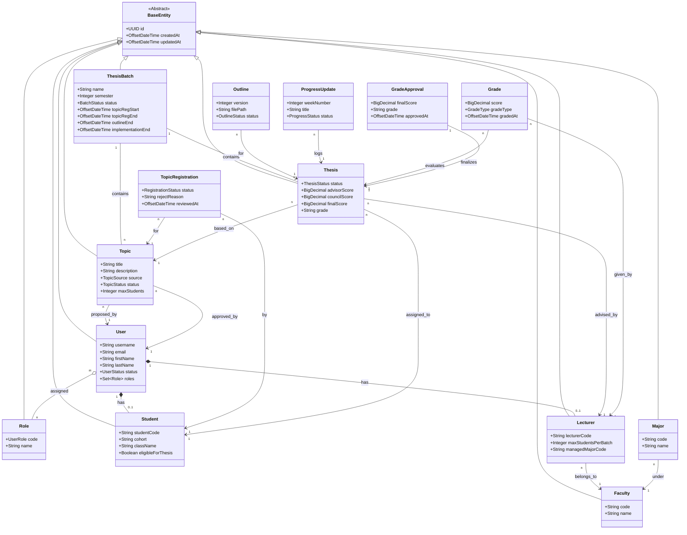

# Class Diagram - Thesis Management System

This diagram illustrates the core entity relationships within the backend application.

```mermaid
classDiagram
    class BaseEntity {
        <<Abstract>>
        +UUID id
        +OffsetDateTime createdAt
        +OffsetDateTime updatedAt
    }

    class User {
        +String username
        +String email
        +String firstName
        +String lastName
        +UserStatus status
        +Set~Role~ roles
    }

    class Role {
        +UserRole code
        +String name
    }

    class Student {
        +String studentCode
        +String cohort
        +String className
        +Boolean eligibleForThesis
    }

    class Lecturer {
        +String lecturerCode
        +Integer maxStudentsPerBatch
        +String managedMajorCode
    }

    class ThesisBatch {
        +String name
        +Integer semester
        +BatchStatus status
        +OffsetDateTime topicRegStart
        +OffsetDateTime topicRegEnd
        +OffsetDateTime outlineEnd
        +OffsetDateTime implementationEnd
    }

    class Topic {
        +String title
        +String description
        +TopicSource source
        +TopicStatus status
        +Integer maxStudents
    }

    class TopicRegistration {
        +RegistrationStatus status
        +String rejectReason
        +OffsetDateTime reviewedAt
    }

    class Thesis {
        +ThesisStatus status
        +BigDecimal advisorScore
        +BigDecimal councilScore
        +BigDecimal finalScore
        +String grade
    }

    class Outline {
        +Integer version
        +String filePath
        +OutlineStatus status
    }

    class ProgressUpdate {
        +Integer weekNumber
        +String title
        +ProgressStatus status
    }

    class Grade {
        +BigDecimal score
        +GradeType gradeType
        +OffsetDateTime gradedAt
    }

    class GradeApproval {
        +BigDecimal finalScore
        +String grade
        +OffsetDateTime approvedAt
    }

    class Faculty {
        +String code
        +String name
    }

    class Major {
        +String code
        +String name
    }

    BaseEntity <|-- User
    BaseEntity <|-- Role
    BaseEntity <|-- Student
    BaseEntity <|-- Lecturer
    BaseEntity <|-- ThesisBatch
    BaseEntity <|-- Topic
    BaseEntity <|-- Thesis
    BaseEntity <|-- Faculty
    BaseEntity <|-- Major

    User "1" *-- "0..1" Student : has
    User "1" *-- "0..1" Lecturer : has
    User "m" o-- "n" Role : assigned
    
    Lecturer "n" --> "1" Faculty : belongs_to
    Major "n" --> "1" Faculty : under

    ThesisBatch "1" -- "n" Topic : contains
    ThesisBatch "1" -- "n" Thesis : contains
    
    Topic "n" --> "1" User : proposed_by
    Topic "n" --> "1" User : approved_by
    
    TopicRegistration "n" --> "1" Topic : for
    TopicRegistration "n" --> "1" Student : by
    
    Thesis "n" --> "1" Student : assigned_to
    Thesis "n" --> "1" Topic : based_on
    Thesis "n" --> "1" Lecturer : advised_by
    
    Outline "n" --> "1" Thesis : for
    ProgressUpdate "n" --> "1" Thesis : logs
    
    Grade "n" --> "1" Thesis : evaluates
    Grade "n" --> "1" Lecturer : given_by
    GradeApproval "1" --> "1" Thesis : finalizes
```
