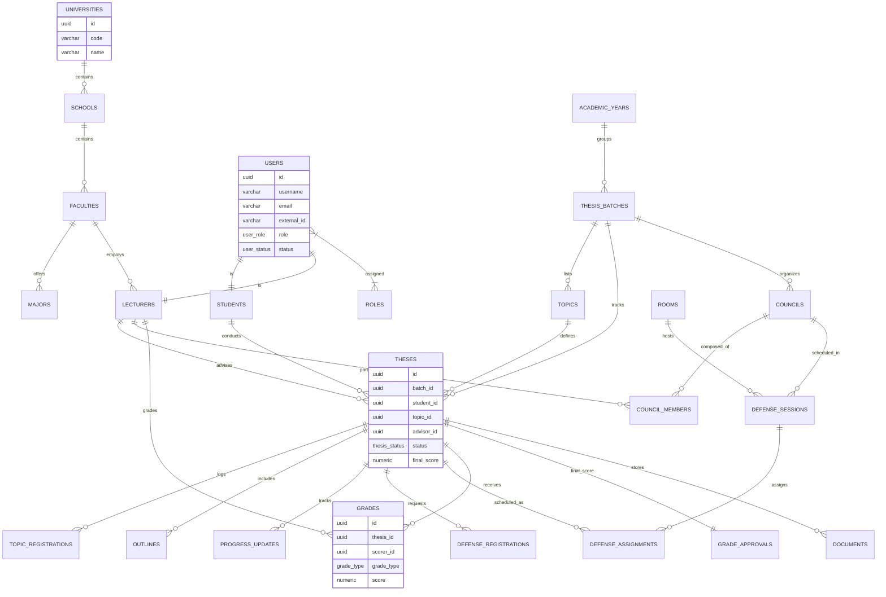

# Database Diagram - Thesis Management System

This diagram represents the relational schema of the database.

```mermaid
erDiagram
    UNIVERSITIES ||--o{ SCHOOLS : contains
    SCHOOLS ||--o{ FACULTIES : contains
    FACULTIES ||--o{ MAJORS : offers
    FACULTIES ||--o{ LECTURERS : employs
    
    USERS ||--|| STUDENTS : is
    USERS ||--|| LECTURERS : is
    USERS }|--|{ ROLES : assigned
    
    ACADEMIC_YEARS ||--o{ THESIS_BATCHES : groups
    THESIS_BATCHES ||--o{ TOPICS : lists
    THESIS_BATCHES ||--o{ THESES : tracks
    
    STUDENTS ||--o{ THESES : conducts
    TOPICS ||--o{ THESES : defines
    LECTURERS ||--o{ THESES : advises
    
    THESES ||--o{ TOPIC_REGISTRATIONS : logs
    THESES ||--o{ OUTLINES : includes
    THESES ||--o{ PROGRESS_UPDATES : tracks
    THESES ||--o{ DEFENSE_REGISTRATIONS : requests
    
    THESIS_BATCHES ||--o{ COUNCILS : organizes
    COUNCILS ||--o{ COUNCIL_MEMBERS : composed_of
    LECTURERS ||--o{ COUNCIL_MEMBERS : participates
    
    COUNCILS ||--o{ DEFENSE_SESSIONS : scheduled_in
    ROOMS ||--o{ DEFENSE_SESSIONS : hosts
    DEFENSE_SESSIONS ||--o{ DEFENSE_ASSIGNMENTS : assigns
    THESES ||--o{ DEFENSE_ASSIGNMENTS : scheduled_as
    
    THESES ||--o{ GRADES : receives
    LECTURERS ||--o{ GRADES : grades
    THESES ||--|| GRADE_APPROVALS : final_score
    
    THESES ||--o{ DOCUMENTS : stores

    UNIVERSITIES {
        uuid id
        varchar code
        varchar name
    }
    USERS {
        uuid id
        varchar username
        varchar email
        varchar external_id
        user_role role
        user_status status
    }
    THESES {
        uuid id
        uuid batch_id
        uuid student_id
        uuid topic_id
        uuid advisor_id
        thesis_status status
        numeric final_score
    }
    GRADES {
        uuid id
        uuid thesis_id
        uuid scorer_id
        grade_type grade_type
        numeric score
    }
```
